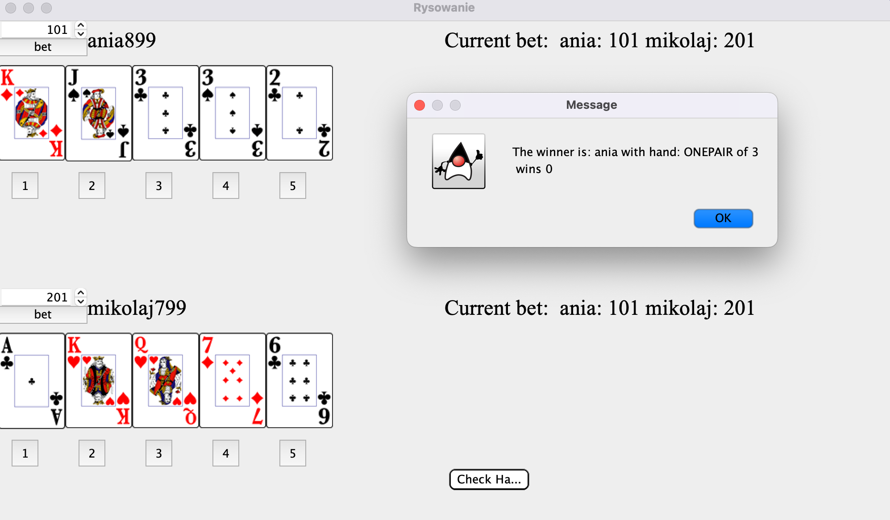

# Poker
> Simple two players Poker game. 
## Table of Contents
* [General Info](#general-information)
* [Technologies Used](#technologies-used)
* [Features](#features)
* [Project Status](#project-status)
* [Contact](#contact)
<!-- * [License](#license) -->

## General Information
- Game build for fun and learning.

<!-- You don't have to answer all the questions - just the ones relevant to your project. -->

## Technologies Used
- Java Swing

## Screenshots

## Features
List the ready features here:
- Card exchanging
- Player's betting
- checking Player's hand

## Contact
Created by [@telusmikolaj](https://www.linkedin.com/in/miko%C5%82aj-telus-84aa7122b) - feel free to contact me!

<!-- You don't have to include all sections - just the one's relevant to your project -->
